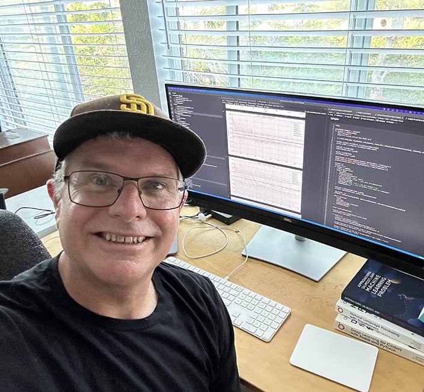

::: {.hero-wrap}

 Available for new engagements

# AI products that actually ship

::: {.hero-lede}
I design, build, and deploy LLM-powered products end to end: eval-first AI pipelines, production-grade APIs, and polished front-ends. Backed by 25+ years of shipping software for companies of every size.
:::

[<i class="bi bi-envelope-fill"></i> Discuss your project](mailto:wgilliam@ohmeow.com){.ohmeow-button}
[See services](#services){.ohmeow-button-outline}

<i class="bi bi-cpu-fill"></i> LLMs, evals &amp; ML<i class="bi bi-stack"></i> FastAPI · Vue · React · Postgres<i class="bi bi-github"></i> Author of blurr · fast.ai community leader

<i></i><i></i><i></i>ohmeow — engagement.log

$ohmeow ship --product "ai-assistant"

→discoverscope the problem, define success

→evalsmeasure quality before writing prompts

→pipelineLLM + retrieval + guardrails

→full-stackFastAPI · Vue · Postgres · Docker

→deploycloud, CI/CD, monitoring

✔shippedmeasured, monitored, improving

:::

::: {.stat-strip}

25<em>+</em>Years shipping software

10<em>+</em>Companies served, startups to enterprise

End<em>-</em>to<em>-</em>endStrategy, models, APIs, UI, deployment

Eval<em>-</em>firstAI you can measure, trust, and improve

:::

::: {.om-section}

What I do

## Services {#services}

::: {.section-sub}
Practical, production-minded help for teams that want AI features and applications that work in the real world, not just in a demo.
:::

::: {.service-grid}

::: {.service-card}
<i class="bi bi-cpu-fill service-icon"></i>

#### AI / ML Application Development

Applied AI tailored to your business, from first prototype to a monitored, production system.

- <i class="bi bi-check-circle-fill"></i> LLM apps, RAG, agents &amp; NLP workflows
- <i class="bi bi-check-circle-fill"></i> Forecasting &amp; classification models
- <i class="bi bi-check-circle-fill"></i> Eval-first pipelines with measurable quality
:::

::: {.service-card}
<i class="bi bi-stack service-icon"></i>

#### Full-Stack Engineering

Robust, scalable web platforms engineered with modern tooling and a strong DevOps mindset.

- <i class="bi bi-check-circle-fill"></i> Vue, Quasar, React, Next.js front-ends
- <i class="bi bi-check-circle-fill"></i> FastAPI, ASP.NET Core, Node.js back-ends
- <i class="bi bi-check-circle-fill"></i> PostgreSQL, Docker &amp; cloud deployments
:::

::: {.service-card}
<i class="bi bi-compass-fill service-icon"></i>

#### AI Strategy &amp; Enablement

Hands-on guidance so your team adopts, evaluates, and operates AI with confidence.

- <i class="bi bi-check-circle-fill"></i> Technical evaluations &amp; model benchmarking
- <i class="bi bi-check-circle-fill"></i> AI-driven product architecture
- <i class="bi bi-check-circle-fill"></i> Team training &amp; workshops
:::

:::
:::

::: {.om-section}

How I work

## From idea to production, without the guesswork {#process}

::: {.section-sub}
A simple, transparent process that keeps risk low and momentum high.
:::

::: {.process-grid}

::: {.process-step}
01

#### Discover

We scope the problem, the users, and what "good" looks like, then agree on a plan measured in weeks, not quarters.
:::

::: {.process-step}
02

#### Prototype

A working slice of the product, fast. Real data, real users, real feedback before big investments are made.
:::

::: {.process-step}
03

#### Evaluate

Evals and error analysis drive every iteration, so quality is something we can see and improve, not just feel.
:::

::: {.process-step}
04

#### Ship &amp; support

Deployed, monitored, documented, and handed off cleanly, with ongoing support when you want it.
:::

:::
:::

::: {.om-section}

Track record

## Clients &amp; employers {#clients}

::: {.section-sub}
I've had the pleasure of building with great companies across research, agriculture, e-commerce, education, and enterprise software.
:::

::: {.client-cards}

Answer.AI

Contributed to core libraries and tutorials driving open-source innovation in LLM tooling.

Musubilabs

Delivered ML pipelines and FastAPI backends to power cutting-edge conversational AI tools.

Weights &amp; Biases

Created educational content training ML developers to use fast.ai and blurr with Hugging Face transformers across NLP tasks.

Agrilynk

Architected and built a production-ready AI platform to support real-time agricultural insights.

UC San Diego

Built an enterprise survey delivery and analytics platform, an AI pipeline for qualitative data, and forecasting models for HR employment needs.

Cotelligent

Provided enterprise-grade software development and architecture consulting.

Epson

Helped streamline development workflows with tailored software solutions.

Car Crazy Central

Built branded digital experiences and backend infrastructure for media-rich applications.

BuyProduce.com

Built and led a dev team creating a flexible e-commerce engine for the produce industry.

AltaVista / Shopping.com

Rebuilt e-commerce systems and led backend dev teams at the forefront of early internet retail.

:::
:::

::: {.om-section}

From the blog

## Latest writing {#writing}

::: {.section-sub}
Notes from the trenches on evals, LLMs, fast.ai, and full-stack engineering.
:::

[View all posts <i class="bi bi-arrow-right"></i>](blog.html){.ohmeow-button-outline}

::: {#recent-posts}
:::
:::

::: {.om-section}

Who I am

## About me {#about}

::: {.about-wrap}

Wayde Gilliam

Founder of ohmeow · Full-stack &amp; AI/ML engineer

I'm a full-stack web application and AI/ML developer with well over 20 years in the business. I've led teams and shipped systems for early-internet retail giants, universities, startups, and research labs, and these days I spend most of my time building LLM-powered products that are measured as carefully as they are engineered.

I'm the author of [blurr](https://ohmeow.github.io/blurr/){target="_blank"}, a Python library that lets fast.ai developers train Hugging Face transformers for core NLP tasks, and a proud [fast.ai community leader](https://forums.fast.ai/u/wgpubs/summary){target="_blank"}, contributing to the library and helping folks on the forums and Discord.

Outside of work I enjoy hanging out with my two labradors, reading, working out, and above all else, learning.

PythonPyTorchfast.aiHugging FaceLLMs &amp; evalsFastAPIVue / QuasarReact / Next.jsASP.NET CorePostgreSQLDockerCloud / CI

[<i class="bi bi-envelope-fill"></i> Email me](mailto:wgilliam@ohmeow.com){.ohmeow-button}
[<i class="bi bi-file-earmark-arrow-down"></i> Resume](resume_wgilliam_202505.pdf){.ohmeow-button-outline target="_blank"}
[<i class="bi bi-github"></i> GitHub](https://github.com/ohmeow){.ohmeow-button-outline target="_blank"}
[<i class="bi bi-linkedin"></i> LinkedIn](https://linkedin.com/in/waydegilliam){.ohmeow-button-outline target="_blank"}
[<i class="bi bi-twitter-x"></i> X](https://x.com/waydegilliam){.ohmeow-button-outline target="_blank"}

:::
:::

::: {.cta-banner}
## Have an AI project in mind?

Whether it's an LLM-powered product, an ML pipeline, or a second opinion on your AI strategy, let's talk about what I can build for you.

[<i class="bi bi-envelope-fill"></i> wgilliam@ohmeow.com](mailto:wgilliam@ohmeow.com){.ohmeow-button}
[<i class="bi bi-file-earmark-arrow-down"></i> Download resume](resume_wgilliam_202505.pdf){.ohmeow-button-outline target="_blank"}

:::
